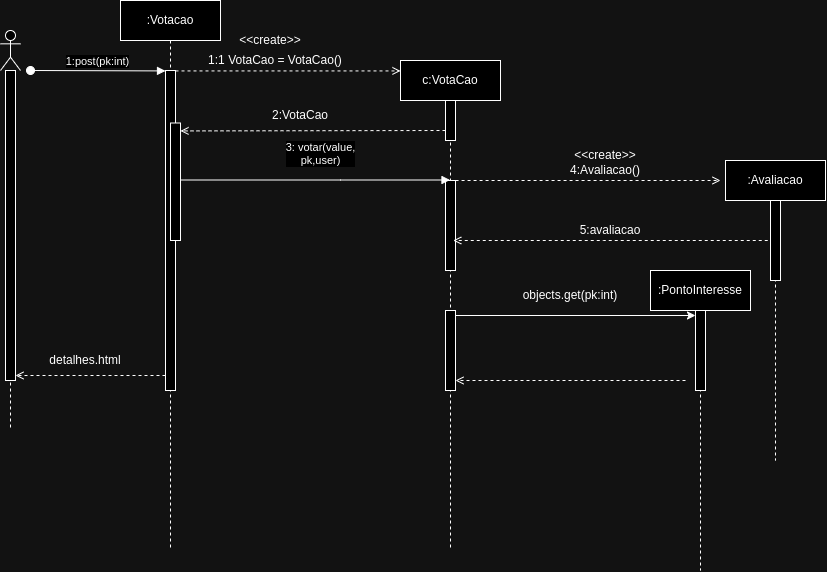

# CDU001. Avaliar Ponto de Interesse

- **Usuário**: Usuário Geral
- **Resumo**: O usuário avalia com nota de 0 a 5 ponto de interesse visitado
- **pré-condição**: Ter visitado ou feito reserva no ponto de interesse
- **Pós-Condição**: O comentário ou avaliação será atribuído ao ponto de interesse especificado

## [Regras de negócio](/doc/RegrasNegocio/Regras.md) - RN01, RN02

## Fluxo Principal
| Ações do ator | Ações do sistema |
| :-----------------: | :-----------------: | 
| 1 - O usuário entra com um endereço válido e aciona a funcionalidade de procura. |  |  
| | 2 - O sistema mostra pontos de interesses disponíveis na rota entre o endereço de origem e destino. | 
| 3 - O usuário escolhe uma opção dos pontos retornados do sistema. | |
| | 4 - O sistema mostra a página de  detalhes do ponto de interesse escolhido.|
| 5 - O usuario  seleciona a opção de nota com estrelas e escolhe um número de 0 a 5 (sendo 0 muito ruim e 5 ótimo) com a opção de escrever ou não um comentário para a avaliação. | | 
| | 6 - O sistema verifica se o usário tem permissão para fazer avaliação e caso tenha, pergunta se deseja confirmar.|
| 7 - O usuário  decide se confirma ou não.| |
| | 6 - O sistema publica a avaliação e encerra o caso de uso.|

## Fluxo de Exceção I - Usuário sem permissão
| Ações do ator | Ações do sistema |
| :-----------------: |:-----------------: | 
| 6.1 - O usário não tem permissão (Não logado) | |  
| | X.2 - O sistema redireciona página de login. |

