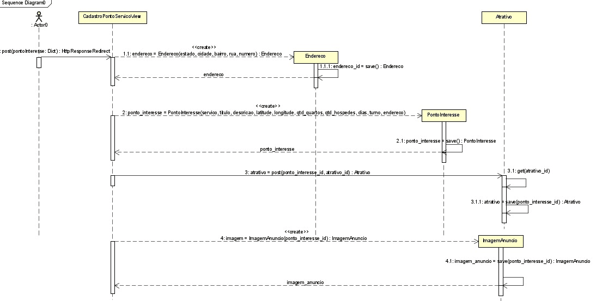

# CDU002. Cadastrar ponto 

- **Ator principal**: Usuário Geral
- **Atores secundários**:-
- **Resumo**: O usuário cria um ponto de interesse.
- **Pré-condição**: Estar logado.
- **Pós-Condição**: Um novo ponto de interesse é cadastrado no sistema.

## [Regras de negócio](/doc/RegrasNegocio/Regras.md) - RN05

## Fluxo Principal
| Ações do ator | Ações do sistema |
| :-----------------: |:-----------------: | 
| 1 - O usuário escolhe  no formulário entre as 4 categorias pré-cadastradas de ponto de interesse. | |  
| | 2 - O sistema valida as entradas e redireciona para o próximo formulário. |
| 3- O usuário tem acesso a uma caixa de texto para descrição do ponto de interesse que quer divulgar.| |
| | 4 - O sistema valida as entradas e redireciona para o próximo formulário. |
| 5 - O usuário tem acesso a campos para escolha de arquivo para colocar imagens do ponto de interesse. | |
| | 6 - O sistema valida as entradas e redireciona para o próximo formulário.|
| 7 - O usuário escolhe entre os atrativos pré-cadastrados (ex: wifi, ar-condicionado, etc.).| |
| | 8 - O sistema valida as entradas e redireciona para o próximo formulário.|
| 9 - O usuário informa o horário de funcionamento disponível, selecionando turno e dias da semana | 

## Fluxo de Exceção I - Sem dados obrigatórios( Inicia nos passos: 1 ou 3 ou 5 ou 7 ou 9 )
| Ações do ator | Ações do sistema |
| :-----------------: |:-----------------: | 
| A - O usuário não insere algum dos dados e quer passar para o próximo formulário| |  
| | B - O sistema retorna mensagem informando para inserir os dados |

