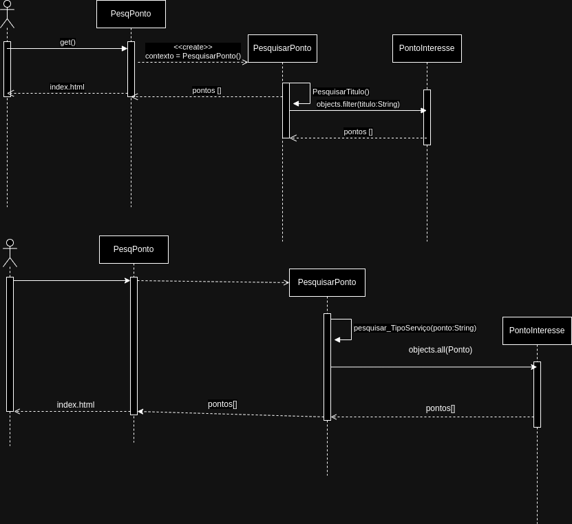

# CDU001. Pesquisar Ponto

- **Usuário**: Usuário Geral
- **Resumo**: O usuário pesquisa ponto de interesse específico.
- **pré-condição**: -
- **Pós-Condição**: Mostrar ponto de interesse pesquisado OU mensagem de exceção.

## Fluxo Principal
| Ações do ator | Ações do sistema |
| :-----------------: | :-----------------: | 
| 1 - O usuário pela caixa de pesquisa digita o nome do ponto de interesse que ele quer encontrar (ex: restaurante Caju's) |  |  
| | 2 - O sistema mostra o ponto de interesse que o usuário deseja | 

## Fluxo Alternativo I - Ponto não existe
| Ações do ator | Ações do sistema |
| :-----------------: |:-----------------: | 
| 1.1 - O usuário pela caixa de pesquisa digita o nome do ponto de interesse que ele quer encontrar (ex: restaurante Caju's) | |  
| | 1.2 -  O sistema mostra uma mensagem informando que o ponto de interesse não existe.|

