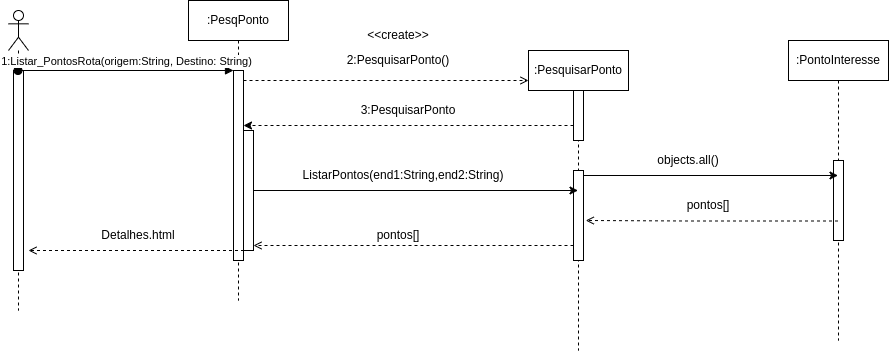

# CDU002. Pesquisar Rota

- **Usuário**: Usuário
- **Resumo**: O usuário pesquisa destino específico.
- **pré-condição**: -
- **Pós-Condição**: Mostrar pontos de interesse relacionados a esse destino.

## [Regras de negócio](/doc/RegrasNegocio/Regras.md) - RN03, RN04

## Fluxo Principal
| Ações do ator | Ações do sistema |
| :-----------------: |:-----------------: | 
| 1 - O usuário insere endereço físico de partida e outro endereço para chegada nos de pesquisa do mapa |  |  
| | 2 - O sistema renderiza a rota no mapa, do ponto de partida até o de chegada | 
| | 3 - O sistema retorna pontos de interesse em que estejam dentro da rota de início até a chegada que o usuário digitou. |

<!-- ## Fluxo Alternativo I - Usuário filtra categorias de ponto de interesse
| Ações do ator | Ações do sistema |
| :-----------------: |:-----------------: | 
| 1.1 - Usuário filtra a categoria que deseja listar pontos. | |  
| | 1.2 -  O sistema mostra pontos de interesse relacionados a essa categoria.| -->

