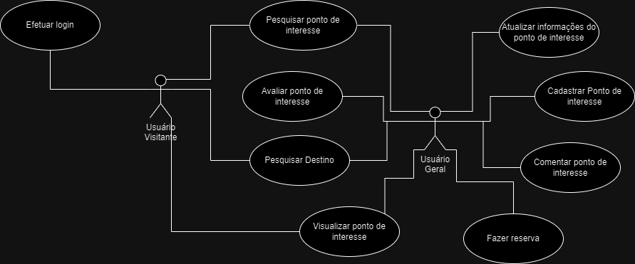

# Modelo de Casos de Uso

## 1. Diagrama de Casos de Uso

## 2. Listagem dos detalhamentos dos casos de uso

9-documentar-os-principais-cdus
1. [CDU-001 - Avaliar Ponto de Interesse](cdu-001/detalhamento-001.md)
2. [CDU-002 - Cadastrar Ponto](cdu-002/detalhamento-002.md)
3. [CDU-003 - Pesquisar Ponto](cdu-003/detalhamento-003.md)
4. [CDU-004 - Pesquisar Destino](cdu-004/detalhamento-004.md)

